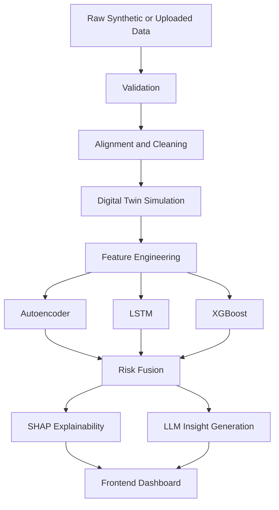

# StructureX

<p align="center">
  
</p>

<p align="center">
  
  
  
  
  
  
</p>

StructureX is an AI-powered infrastructure risk intelligence platform for analyzing structural health using simulated telemetry, machine learning, explainability, and a browser-based command center. The project combines a digital twin style simulation pipeline with three risk models, SHAP-based explanations, and natural-language AI insights to help users explore failure risk across buildings, bridges, and similar assets.

It is designed as a full-stack portfolio project with:

- a FastAPI backend for simulation, analysis, and inference
- a frontend dashboard built with HTML, CSS, vanilla JavaScript, Plotly, and a 3D map UI
- synthetic data generation scripts for infrastructure telemetry
- saved model artifacts and a training pipeline for retraining locally

## Table of Contents

- [Why StructureX](#why-structurex)
- [Key Features](#key-features)
- [How It Works](#how-it-works)
- [Tech Stack](#tech-stack)
- [Project Structure](#project-structure)
- [Getting Started](#getting-started)
- [Running the Project](#running-the-project)
- [API Reference](#api-reference)
- [Data and Model Artifacts](#data-and-model-artifacts)
- [Frontend Experience](#frontend-experience)
- [Troubleshooting](#troubleshooting)
- [Contributing](#contributing)
- [License](#license)

## Why StructureX

Traditional structural monitoring dashboards often stop at showing raw metrics. StructureX pushes further by combining:

- simulated environmental and structural telemetry
- feature engineering on time-series infrastructure data
- hybrid AI inference using multiple model types
- risk fusion into one interpretable score
- explainability through feature contribution analysis
- natural-language summaries for faster decision-making

The result is a project that is useful both as a software engineering build and as an applied AI/ML showcase.

## Key Features

### 1. Digital Twin Simulation Pipeline

StructureX generates synthetic infrastructure telemetry by modeling:

- earthquake activity and seismic impact
- soil composition, density, and moisture
- weather effects such as temperature, wind, and rainfall
- structural response such as vibration, strain, load, and fatigue

### 2. Hybrid AI Risk Engine

The backend combines three separate model families:

- Autoencoder for anomaly detection on engineered sensor features
- LSTM for time-series based failure probability and degradation prediction
- XGBoost for tabular environmental risk scoring

These outputs are fused into a single global risk score with category labels such as `SAFE`, `WARNING`, and `CRITICAL`.

### 3. Explainable AI

StructureX uses SHAP to surface feature contributions behind risk predictions so the user can inspect the drivers of a high-risk result instead of treating the model like a black box.

### 4. Natural-Language Insights

The platform can generate engineering-style summaries and recommendations. The current backend is configured for Gemini via `GEMINI_API_KEY`, with fallback behavior available when a live model response is not available.

### 5. Interactive Dashboard

The frontend includes:

- CSV upload for analysis
- scenario sliders for earthquake magnitude, temperature, and soil moisture
- risk KPIs and status indicators
- time-series charts
- SHAP/explainability views
- AI insight panels
- map-based building analysis workflow

## How It Works



### Pipeline Summary

1. Data is generated or uploaded.
2. The backend validates schema and required columns.
3. Datasets are aligned and fed into the simulation and feature engineering layers.
4. The ML models produce anomaly, failure, degradation, and environmental risk signals.
5. The fusion engine computes a unified risk score.
6. SHAP and AI summaries convert the prediction into something easier to interpret.
7. The frontend renders charts, metrics, and explainability output.

## Tech Stack

### Backend

- Python
- FastAPI
- Uvicorn
- Pydantic
- NumPy
- Pandas
- scikit-learn
- PyTorch
- XGBoost
- SHAP
- Joblib

### Frontend

- HTML
- CSS
- Vanilla JavaScript
- Plotly.js
- Font Awesome
- Google Fonts
- MapTiler SDK

### AI / Insights

- Gemini integration via `google-generativeai`

## Project Structure

```text
StructureX/
|-- assets/
|   `-- header.png
|-- backend/
|   |-- analysis/
|   |   |-- building_analyzer.py
|   |   |-- infrastructure.py
|   |   |-- llm_engine.py
|   |   `-- visualization.py
|   |-- api/
|   |   `-- routes.py
|   |-- data/
|   |   |-- generated/
|   |   |-- alignment.py
|   |   |-- ingestion.py
|   |   `-- validation.py
|   |-- explainability/
|   |   `-- shap_engine.py
|   |-- features/
|   |   `-- engineering.py
|   |-- models/
|   |   |-- saved/
|   |   |-- autoencoder.py
|   |   |-- lstm_model.py
|   |   |-- training.py
|   |   `-- xgboost_model.py
|   |-- risk/
|   |   `-- fusion.py
|   |-- schemas/
|   |   |-- api_schemas.py
|   |   `-- data_schemas.py
|   |-- simulation/
|   |   `-- digital_twin.py
|   |-- config.py
|   `-- main.py
|-- frontend/
|   |-- app.js
|   |-- index.css
|   `-- index.html
|-- scripts/
|   |-- generate_data.py
|   |-- generate_sample_csv.py
|   |-- run_demo.py
|   |-- test_analyze.py
|   `-- train_models.py
|-- LICENSE
|-- README.md
|-- requirements.txt
`-- sample_data.csv
```

### Important Files

- `backend/main.py`: starts FastAPI and serves the frontend
- `backend/api/routes.py`: core API endpoints for analysis and scenarios
- `backend/config.py`: project-wide constants, paths, thresholds, and API settings
- `scripts/run_demo.py`: generate data, train models, and launch the app
- `sample_data.csv`: sample CSV you can use for upload testing

## Getting Started

### Prerequisites

- Python 3.10 or newer
- Git
- Recommended: a virtual environment

### 1. Clone the repository

```bash
git clone https://github.com/your-username/StructureX.git
cd StructureX
```

If your repository already lives under a different GitHub account or organization, replace the URL with your actual repo URL.

### 2. Create and activate a virtual environment

```bash
python -m venv venv
```

Windows PowerShell:

```powershell
.\venv\Scripts\Activate.ps1
```

Windows Command Prompt:

```cmd
venv\Scripts\activate
```

macOS / Linux:

```bash
source venv/bin/activate
```

### 3. Install dependencies

```bash
pip install -r requirements.txt
```

### 4. Optional AI configuration

To enable Gemini-generated insight text, set your API key before launching the backend.

Windows PowerShell:

```powershell
$env:GEMINI_API_KEY="your_api_key_here"
```

Windows Command Prompt:

```cmd
set GEMINI_API_KEY=your_api_key_here
```

macOS / Linux:

```bash
export GEMINI_API_KEY="your_api_key_here"
```

## Running the Project

### Option A: Full demo run

This is the easiest way to experience the whole project. It will:

- generate synthetic datasets
- train the available models
- start the FastAPI server

```bash
python scripts/run_demo.py
```

### Option B: Manual step-by-step run

Generate data:

```bash
python scripts/generate_data.py
```

Train models:

```bash
python scripts/train_models.py
```

Start the backend and frontend server:

```bash
python backend/main.py
```

### Open the app

Once the server is running, open:

```text
http://localhost:8000
```

### Health check

You can verify the service is up with:

```text
http://localhost:8000/health
```

or

```text
http://localhost:8000/docs
```

for FastAPI's interactive API documentation.

## API Reference

The backend mounts its router under `/api`.

### `POST /api/analyze`

Uploads a CSV file, validates it, runs feature engineering, model inference, risk fusion, explainability, chart generation, and AI insight creation.

Typical use case:

- upload a structural telemetry CSV from the dashboard
- receive risk score, category, charts, SHAP features, and natural-language analysis

### `POST /api/scenario`

Runs a what-if scenario by overriding parameters such as:

- `earthquake_magnitude`
- `temperature`
- `soil_moisture`
- `location_id`

This endpoint returns predicted risk plus time-series data for the simulated scenario.

Example payload:

```json
{
  "earthquake_magnitude": 6.8,
  "temperature": 42.0,
  "soil_moisture": 0.85,
  "location_id": "LOC_001"
}
```

### `GET /api/explain`

Returns SHAP-style feature explanations for the latest prediction stored in memory by the backend.

### `POST /api/building-analyze`

Analyzes a building selected in the map interface using location and building metadata.

Example payload:

```json
{
  "lat": 19.076,
  "lng": 72.8777,
  "height": 42,
  "address": "Sample Address",
  "area_name": "Sample Area",
  "properties": {}
}
```

### `GET /health`

Top-level backend health endpoint exposed by `backend/main.py`.

## Data and Model Artifacts

This repository already includes generated outputs in:

- `backend/data/generated/`
- `backend/models/saved/`

That means you can inspect the project structure and existing artifacts immediately, even before retraining.

### Generated data examples

- earthquake data
- soil data
- weather data
- unified aligned data
- engineered feature data
- simulated structure telemetry

### Saved model artifacts

- `autoencoder.pt`
- `lstm_model.pt`
- `xgboost_model.json`
- scaler files used for inference

## Frontend Experience

The frontend is served directly by the FastAPI app, so there is no separate frontend build step in this version of the project.

Main frontend capabilities include:

- upload a CSV for full analysis
- search a location
- adjust scenario sliders
- inspect risk score and failure probability
- view time-series visualizations
- review AI-generated summaries
- inspect explainability output
- explore map-driven building analysis

## Troubleshooting

### Models are not loading

If the backend logs warnings about missing model files, run:

```bash
python scripts/train_models.py
```

### Gemini insights are not appearing

Make sure `GEMINI_API_KEY` is set in the same terminal session where you start the backend.

### Frontend loads but some external UI pieces fail

The frontend depends on CDN-hosted assets such as Plotly, Font Awesome, Google Fonts, and MapTiler SDK. If your network blocks those resources, parts of the UI may not render fully.

### Upload analysis fails

Use `sample_data.csv` or inspect `backend/data/validation.py` to align your input schema with the expected columns and formats.

## Contributing

Contributions are welcome. If you want to improve the simulation logic, frontend UX, model quality, explainability, or documentation:

1. Fork the repository.
2. Create a feature branch.
3. Make your changes.
4. Test locally.
5. Open a pull request with a clear summary.

Good contribution areas include:

- model performance improvements
- richer scenario controls
- better map/building analysis
- UI polish and responsiveness
- stronger test coverage
- documentation and setup improvements

## License

This project is licensed under the MIT License. See [LICENSE](LICENSE) for details.
